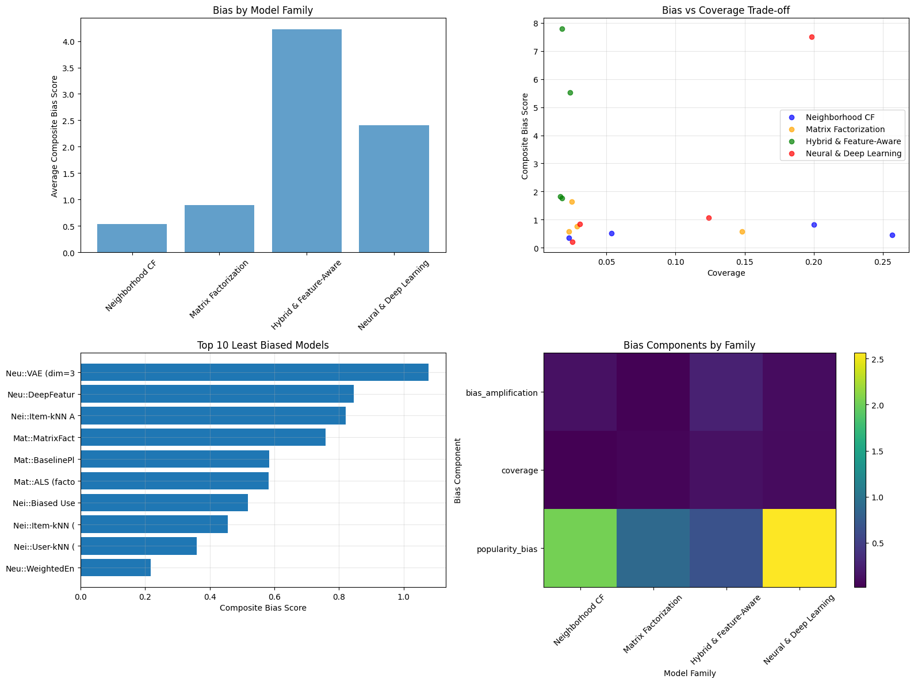

# Causal Debiasing in Recommender Systems: A Comprehensive Analysis

## 🚀 Project Overview

Standard offline evaluations of recommender systems are often flawed. Metrics like accuracy and NDCG are computed on biased data where popular items are heavily over-represented, creating a misleading picture of a model's true performance. A model might seem effective simply because it's good at recommending popular "blockbuster" items that users were likely to see and rate anyway.

This project goes beyond traditional evaluation by applying a rigorous **causal inference framework** to diagnose, quantify, and correct for this **selection bias**. We systematically build and evaluate over 20 recommender models from **five distinct families**, culminating in a debiased evaluation using **Inverse Propensity Scoring (IPS)** to reveal which models are truly effective at finding relevant items, not just popular ones.

### Key Questions Addressed
1.  How do standard recommender models—from simple baselines to complex neural networks—differ across multiple dimensions like accuracy, popularity bias, item coverage, and demographic fairness?
2.  Can we use causal inference to model the selection bias inherent in the MovieLens 100K dataset?
3.  How does our assessment of a model's performance change after correcting for this bias using IPS?
4.  Which models are genuinely good at finding relevant items, and which are simply "gaming" the biased evaluation?

---

## 📈 Methodology: A 5-Phase Pipeline

This project follows a structured, multi-phase pipeline, moving from data exploration to advanced causal analysis.

* **Phase 1: Data Understanding & EDA** 🕵️‍♀️
    * Initial exploration of the MovieLens 100K dataset to understand its distributions, demographics, and temporal patterns.

* **Phase 2: Temporal Splitting & Feature Engineering** 🔪
    * Splitting the data into train/validation/test sets based on timestamps to simulate a real-world production environment and prevent data leakage.
    * Engineering a rich set of user, item, and temporal features.

* **Phase 3: Comprehensive Model Evaluation (The "Biased" View)** 📊
    * Systematic training and evaluation of 20+ models from five distinct families:
        1.  **Baselines** (`Global Mean`, `Popularity`, `Item Mean`)
        2.  **Neighborhood-based CF** (`User-kNN`, `Item-kNN`)
        3.  **Matrix Factorization** (`BaselinePlus`, `SVD`, `ALS`)
        4.  **Hybrid & Feature-Aware** (`ContentBased`, `FeatureBased`, `FactorizationMachine`)
        5.  **Neural & Deep Learning** (`NCF`, `VAE`, `WeightedEnsemble`)
    * Evaluation was performed across a wide range of metrics beyond simple accuracy.

* **Phase 4: Causal Analysis & Debiased Evaluation** ⚖️
    * **Causal DAG:** Designed a Directed Acyclic Graph (DAG) to map the causal pathways of selection bias.
      
    * **Propensity Modeling:** Engineered a rich feature set to train a highly accurate (AUC > 0.85) and well-calibrated XGBoost model to predict the propensity (probability) of any user-item interaction being observed.
    * **Debiased Evaluation:** Used the propensity scores to perform **Inverse Propensity Scoring (IPS)**, re-calculating model performance to give more weight to successful recommendations of unpopular "hidden gems."

* **Phase 5: Debiasing Techniques (Future Work)** 💡
    * The project concludes with a detailed plan to implement and compare four advanced debiasing methods: Architectural Modifications, IPS Re-weighting, Adversarial Debiasing, and Post-Processing Re-ranking.

---

## 💡 Key Findings & Insights

The causal analysis revealed that standard evaluations are not just slightly inaccurate—they are fundamentally misleading.

#### The "Great Re-ranking": Debiasing Flips the Leaderboard
The most profound finding is that the best models in a standard evaluation are not the best after correcting for bias.

* **Inflated Scores Revealed:** Models that looked decent on standard NDCG (like `Global Mean`) saw their scores plummet after IPS correction. Their performance was an illusion created by recommending popular items.
* **Hidden Champions Emerge:** Models like **`User-kNN`** and **`Item Mean`** looked poor on standard ranking metrics but became top performers after debiasing. Their ability to find relevant, unpopular items was unfairly penalized by the biased test data.

*This summary shows the average bias score by model family, the bias vs. coverage trade-off, a ranking of the top 10 least biased models, and a heatmap of bias components across four key families.*

#### Top Performing Models
* **Best All-Rounder (Accuracy & Low Bias):** `WeightedEnsemble`
* **Best Debiased Performer (Hidden Champion):** `User-kNN`
* **Most Accurate (Lowest RMSE):** `BaselinePlus`
* **Best for Catalog Coverage:** `Item-kNN`

#### Critical Trade-offs Quantified
* **Accuracy vs. Bias:** No single model was best at both. The most accurate models were not always the least biased.
* **Coverage vs. Precision:** The models that recommended the widest variety of items (`Item-kNN`) were not the most precise in their top-10 lists.
* **Complexity vs. Bias:** The most complex models (Neural Networks) were often the most susceptible to learning and amplifying the popularity bias present in the data.

---
